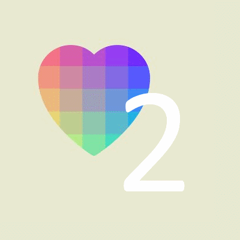
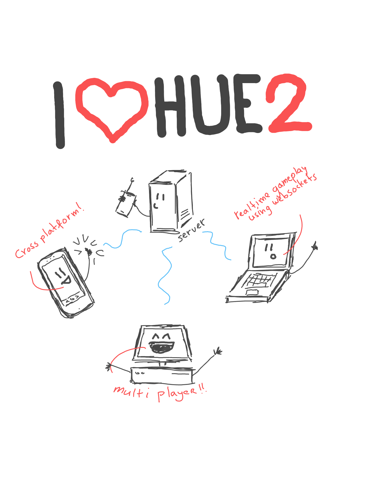
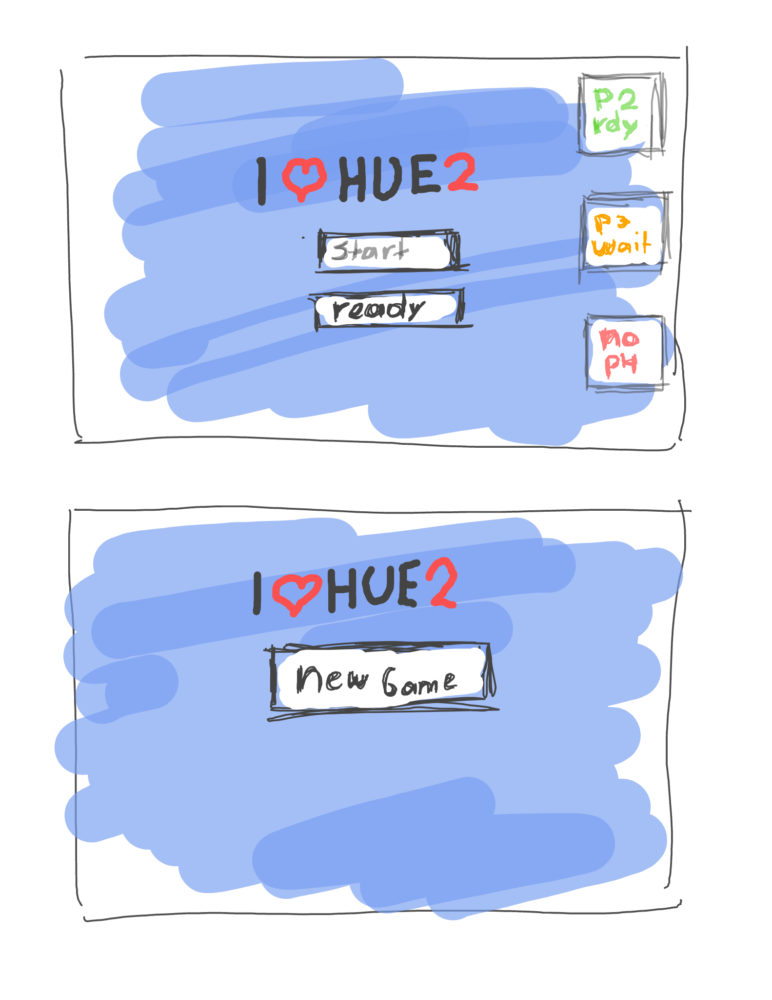
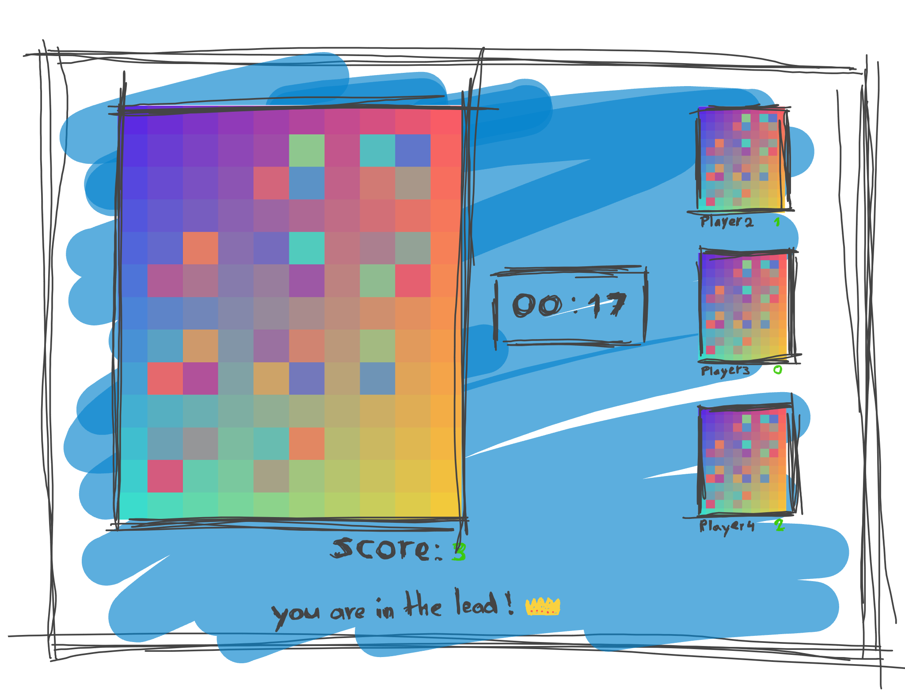
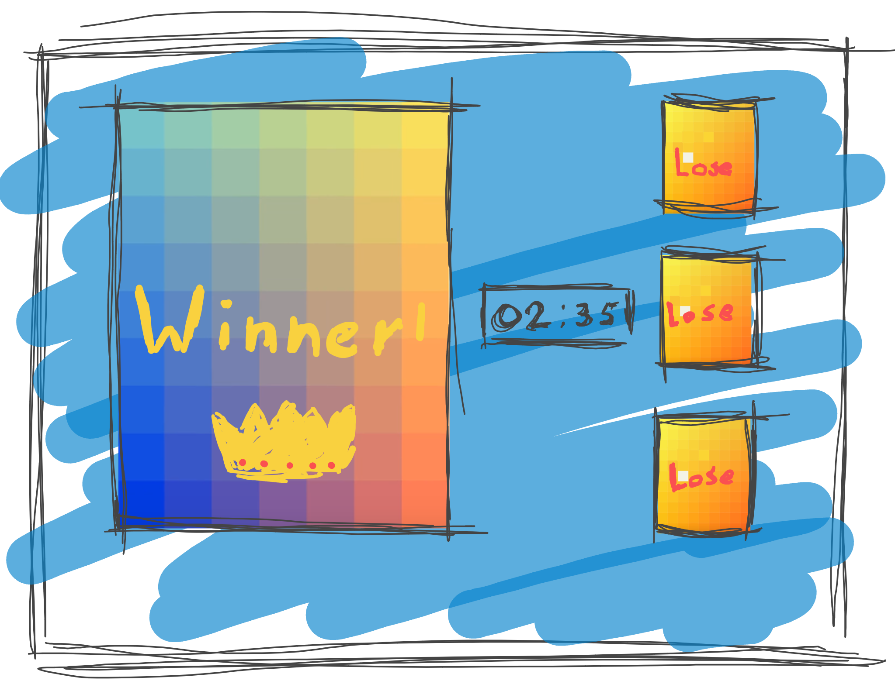

# i-love-hue-2


## I love hue, but multiplayer!
Have you wanted to test your gradient-swapping skills against your friends?
Now you can! With I love hue 2 with realtime multiplayer capabilities.

This game was built whithin a week and contains more than a few bugs.

### Clone
run 
```
git clone https://github.com/daftfox/i-love-hue-2.git

cd i-love-hue-2
git checkout develop
git pull origin develop
```
in a terminal window.
Give it a minute to complete. This game contains soundfiles that take a little while to download.
### Run
Windows: 
```
npm run start_stack_windows
```

Mac: **untested!**
```
npm run start_stack_mac
```
Two terminals should pop up setting up and starting both the client and server app. Have a cup of coffee while this
takes place. Both apps should be up and running whithin ten minutes.

## Sketches




